# 美妆产品用户用户行为分析

## 一、项目简介

本项目基于天猫平台的美妆店铺用户行为数据集，通过Navicat连接MySQL进行系统化数据处理，从用户行为特征与商品属性两个核心维度展开深度分析。分析过程综合运用Excel和SQL进行数据提取与预处理、Power BI和Python完成可视化呈现，最终形成多维度原因分析，为美妆店铺的运营策略优化、商品选品调整及用户精细化运营提供数据支持。

技术栈：Excel、SQL、Python、Power BI。

## 二、数据来源及基本情况说明
**数据来源**：阿里巴巴天池公开数据集（https://tianchi.aliyun.com/dataset/196209），该数据集聚焦天猫平台美妆品类用户行为，具有较高的代表性。

**数据字段说明**：
user_id（用户 id）：唯一标识用户的整数型字段，支持用户行为追踪；
item_id（商品 id）：唯一标识商品的整数型字段，用于商品维度分析；
item_category（商品类别 id）：商品所属品类的整数型标识，支持品类分析；
hour（时间）：用户行为发生的小时数（0-23），反映时段分布特征；
date（日期）：用户行为发生的具体日期；
user_geohash（用户所在省份）：用户地理位置信息，用于地域分布分析；
behavior_type（用户行为标签）：1 - 浏览、2 - 收藏、3 - 加购物车、4 - 购买，构成用户行为链路的核心指标。

**数据规模**：原始数据集包含 104 万 + 条记录，覆盖一个月的用户行为数据，样本量充足，能够有效反映美妆用户的典型行为特征。

## 三、数据预处理
### 1、数据清洗
第一步，为了方便阅读，数据先改一下列名。
```sql
ALTER TABLE customers_beauty_data​
    CHANGE f1 user_id int, ​
    CHANGE f2 item_id int,   ​
    CHANGE f3 behavior_type varchar(5), ​
    CHANGE f4 item_category int,​
    CHANGE f5 date varchar(255),​
    CHANGE f6 hour int,​
    CHANGE f7 user_geohash varchar(255)
```

然后处理空值、重复值、异常值。
```sql
SELECT *
FROM customer_beauty_data
WHERE user_id is null 
or item_id is null 
or item_category is null 
or behavior_type is null 
or date is null 
or hour is null
or user_geohash is null;
-- 结果1可以看到，数据集无空值
```
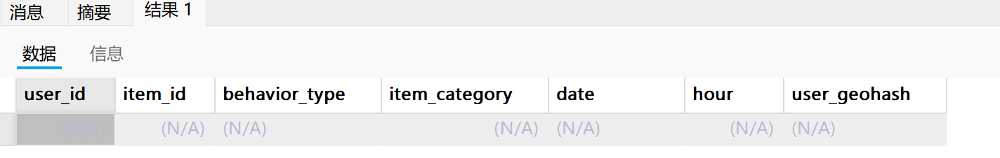

```sql
-- 接下来处理重复值
SELECT
    user_id,
    item_id,
    date,
    hour,
    behavior_type,
    user_geohash
FROM
    customer_beauty_data
GROUP BY
    user_id,
    item_id,
    date,
    hour,
    behavior_type,
    user_geohash
HAVING
    COUNT(*) > 1;
-- 结果2可以看到重复记录有2000+，接下来将它们去重

-- 因为发现直接delete耗时太久了，这里建一个临时表存储去重记录再插回原表    
-- DROP TABLE temp_table;
CREATE TABLE temp_table AS 
SELECT DISTINCT * 
FROM customer_beauty_data;

TRUNCATE TABLE customer_beauty_data;

INSERT INTO customer_beauty_data 
SELECT * 
FROM temp_table;

DROP TABLE temp_table;
```
数据预处理到这一步就结束了，处理后的数据示例如下：
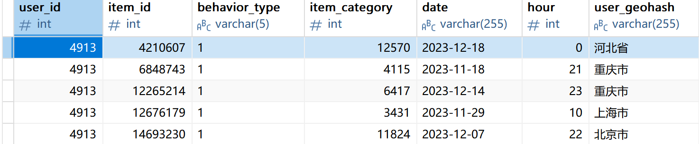


## 三、用户分析
### 1、流量情况
核心指标：PV(浏览量)、UV(浏览人数)、PV/UV(浏览深度)

首先是日流量特征：

```sql
CREATE TABLE ed_pv_uv(date CHAR(10),PV INT(9),UV INT(9),PVUV DECIMAL(10,3));
  ​
INSERT INTO ed_pv_uv    ​
SELECT    ​
    date,    ​
    count(IF(behavior_type=1,1,NULL)) PV,    ​
    count(DISTINCT user_id) UV,    ​
    round(count(IF(behavior_type=1,1,NULL)) /count(DISTINCT user_id),3) PVUV    ​
FROM    ​
    customer_beauty_data    ​
GROUP BY    ​
    date    ​
order by    ​
    date
```
运行结果示例如下：
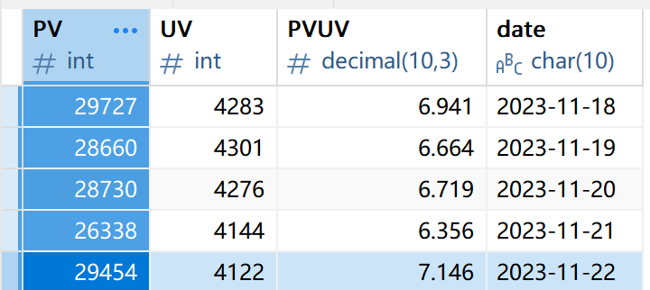

然后是小时级流量分析：

```sql
CREATE TABLE hours_pv_uv (date char(10),pv_hours int(9),uv_hours int(9),pvuv_hours DECIMAL(10,3));

INSERT INTO hours_pv_uv
SELECT
    `hour`,
    count(IF(behavior_type=1,1,NULL)) pv_hours,
    count(DISTINCT user_id) uv_hours,
    round(count(IF(behavior_type=1,1,NULL)) / count(DISTINCT user_id),3) pvuv_hours
FROM
    customer_beauty_data
GROUP BY
    `hour`
ORDER BY
    `hour`;
```
运行结果示例如下：
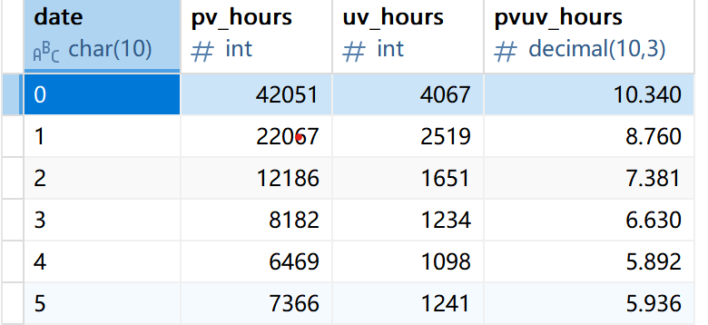

### 2、购买行为
下面看一下用户购买的平均次数和复购率的情况。
先来看每个用户的购买次数：
```sql
CREATE TABLE buy_times    ​
    (    ​
    user_id varchar(25),    ​
    times int(10)    ​
    );    ​
INSERT INTO buy_times    ​
SELECT    ​
    user_id,    ​
    count(user_id) times    ​
FROM    ​
    customer_beauty_data    ​
WHERE    ​
    behavior_type=4    ​
GROUP BY    ​
    user_id,    ​
    user_geohash    ​
order by    ​
    times desc
```
运行结果如下：
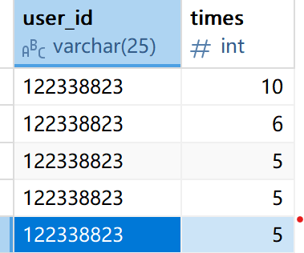

其次我们看复购率(购买次数超过两次的用户与总购买用户之比):

```sql
SELECT    ​
    concat(round(count(sub.user_id)/count(*),2)*100,'%') ratio    ​
FROM    ​
(    ​
SELECT    ​
    user_id    ​
FROM    ​
    customer_beauty_data    ​
WHERE    ​
    behavior_type=4    ​
GROUP BY    ​
    user_id,    ​
    user_geohash    ​
HAVING    ​
    count(user_id) >=2)sub    ​
right JOIN    ​
    customer_beauty_data a on a.user_id=sub.user_id    ​
WHERE    ​
    a.behavior_type = 4
```
运行结果显示，复购用户比例来到了44%。
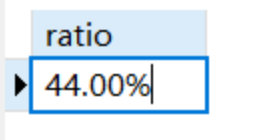

### 3、用户日常粘性

本数据集日期跨度是一个月，属于短期数据，因此在此处计算了次日用户粘性和五日用户粘性。

用户次日粘性定义：在某日有活跃行为的用户中，次日仍保持活跃行为的用户比例。五日粘性以此类推。

特别说明：这个指标参考了次日留存率的设计，但并不是传统意义上的“新用户留存率”。由于数据时间窗口的限制，可能存在周期前的老用户被误判为周期内的新用户的情况，致使数据失真，因此无法进行新用户留存分析。尽管如此，“用户粘性”与“用户留存”在分析功效上是相似的，都可以衡量用户的持续参与度，进而评估周期内各种活动对用户的吸引效果几何。

先来看次日粘性。

```sql
-- 次日粘性
CREATE table df_retention_1
(
    date char(10),
    user_count int,
    retention_user_count int,
    retention_rate decimal(10,3)
);

insert into df_retention_1
select
    cbd1.date,
    count(distinct cbd1.user_id) as user_count,
    count(distinct cbd2.user_id) as retention_user_count,
    round(count(distinct cbd2.user_id)/count(distinct cbd1.user_id),3) as retention_rate
from
    (
        select
            distinct user_id,
            `date`
        from
            customer_beauty_data
    ) cbd1
left join
    (
        select
            distinct user_id,
            `date`
        from
            customer_beauty_data
    ) cbd2
on cbd1.user_id = cbd2.user_id
and cbd2.date = date_add(cbd1.date, interval 1 day)
group by
    cbd1.date
order by
    cbd1.date;
```

再来看五日粘性，五日粘性可用于有效预测中期用户粘性趋势。

```sql
CREATE TABLE df_retention_5    ​
    (    ​
    date VARCHAR(25),    ​
    retention_5 FLOAT    ​
    );    ​
​
INSERT INTO df_retention_5     ​
​
SELECT    ​
    cbd1.`date`,    ​
    count(cbd2.user_id)/count(cbd1.user_id) retention_5    ​
FROM    ​
    (    ​
    SELECT    ​
        distinct user_id,    ​
        `date`    ​
    FROM    ​
        customer_beauty_data    ​
    ) cbd1    ​
LEFT JOIN    ​
    (    ​
    SELECT    ​
        DISTINCT user_id,    ​
        `date`    ​
    FROM    ​
        customer_beauty_data    ​
    ) cbd2    ​
ON cbd1.user_id=cbd2.user_id    ​
AND cbd2.date=DATE_ADD(cbd1.date,INTERVAL 5 day)    ​
group by    ​
    cbd1.date    ​
ORDER BY    ​
    cbd1.date
```

两个代码运行结果如下：
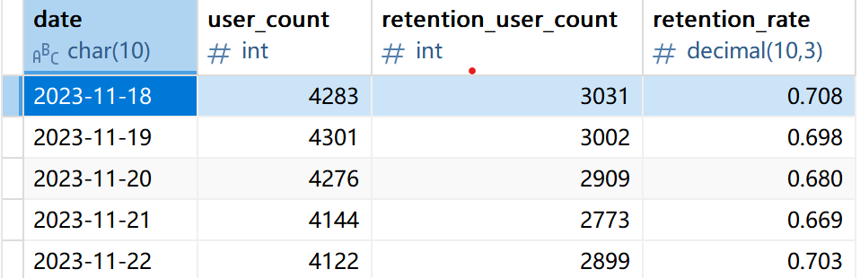
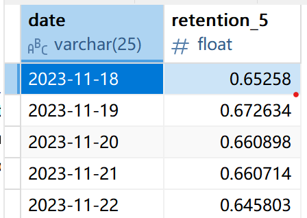


### 4、用户行为统计

我们以日期和时间分组，分别统计不同日期和不同时间下，进行浏览、收藏、加入购物车、购买这四种行为的人数各有多少。

先是对日期分组：

```sql
CREATE TABLE df_users_count_date (date VARCHAR(25),pv_date int(10),fav_date int(10),cart_date int(10),buy_date int(10));

INSERT INTO df_users_count_date
SELECT
    date,
    count(if(behavior_type=1,1,null)) pv_date,
    count(if(behavior_type=2,1,null)) fav_date,
    count(if(behavior_type=3,1,null)) cart_date,
    count(if(behavior_type=4,1,null)) buy_date
FROM
    customer_beauty_data
GROUP BY
    date
ORDER BY
    date;
```

再对小时分组：
```sql
CREATE TABLE df_users_count_hour (`hour` int(9),pv_hour int(10),fav_hour int(10),cart_hour int(10),buy_hour int(10));

INSERT INTO df_users_count_hour
SELECT
    `hour`,
    count(if(behavior_type=1,1,null)) pv_hour,
    count(if(behavior_type=2,1,null)) fav_hour,
    count(if(behavior_type=3,1,null)) cart_hour,
    count(if(behavior_type=4,1,null)) buy_hour
FROM
    customer_beauty_data  
GROUP BY
    `hour`
ORDER BY
    `hour`;
```

运行结果如下：
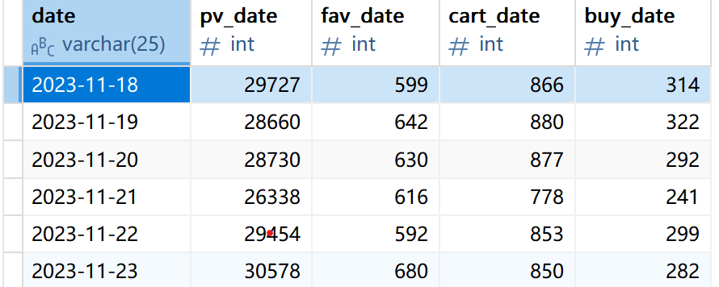

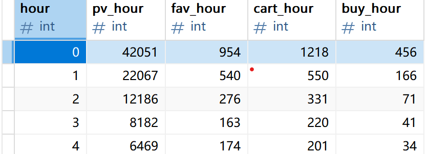


结果储存在一个表格里。

再来看用户行为转化率的漏斗分析：

```sql
-- 存储两条链路的漏斗转化数据
CREATE TABLE funnel_analysis (
    funnel_type VARCHAR(50),  -- 漏斗类型：直接购买/加购收藏后购买
    browse_count INT,         -- 浏览用户数
    middle_count INT,         -- 中间步骤用户数（直接购买链路无中间步骤，记为0）
    buy_count INT,            -- 最终购买用户数
    middle_conversion DECIMAL(10,3),  -- 浏览到中间步骤转化率
    final_conversion DECIMAL(10,3)    -- 浏览到购买最终转化率
);

INSERT INTO funnel_analysis
-- 第一条链路：浏览-直接购买（无加购/收藏行为）
SELECT 
    '浏览-直接购买' AS funnel_type,
    COUNT(DISTINCT b.user_id) AS browse_count,
    0 AS middle_count,  -- 无中间步骤
    COUNT(DISTINCT p.user_id) AS buy_count,
    0 AS middle_conversion,  -- 无中间步骤转化
    ROUND(COUNT(DISTINCT p.user_id) / COUNT(DISTINCT b.user_id), 3) AS final_conversion
FROM 
    -- 筛选有浏览行为的用户
    (SELECT DISTINCT user_id FROM customer_beauty_data WHERE behavior_type = 1) b
LEFT JOIN 
    -- 筛选有购买行为且无加购/收藏行为的用户
    (SELECT DISTINCT user_id 
     FROM customer_beauty_data 
     WHERE behavior_type = 4
       AND user_id NOT IN (
           -- 排除有过加购或收藏行为的用户
           SELECT DISTINCT user_id 
           FROM customer_beauty_data 
           WHERE behavior_type IN (2, 3)
       )) p
ON b.user_id = p.user_id

UNION ALL

-- 第二条链路：浏览-收藏/加购-购买（有中间步骤）
SELECT 
    '浏览-收藏/加购-购买' AS funnel_type,
    COUNT(DISTINCT b.user_id) AS browse_count,
    COUNT(DISTINCT m.user_id) AS middle_count,  -- 加购/收藏用户数
    COUNT(DISTINCT p.user_id) AS buy_count,
    -- 浏览到加购/收藏的转化率
    ROUND(COUNT(DISTINCT m.user_id) / COUNT(DISTINCT b.user_id), 3) AS middle_conversion,
    -- 浏览到最终购买的转化率
    ROUND(COUNT(DISTINCT p.user_id) / COUNT(DISTINCT b.user_id), 3) AS final_conversion
FROM 
    -- 筛选有浏览行为的用户
    (SELECT DISTINCT user_id FROM customer_beauty_data WHERE behavior_type = 1) b
LEFT JOIN 
    -- 筛选有过加购或收藏行为的用户（中间步骤）
    (SELECT DISTINCT user_id 
     FROM customer_beauty_data 
     WHERE behavior_type IN (2, 3)) m
ON b.user_id = m.user_id
LEFT JOIN 
    -- 筛选有购买行为且有过加购/收藏行为的用户
    (SELECT DISTINCT user_id 
     FROM customer_beauty_data 
     WHERE behavior_type = 4
       AND user_id IN (
           SELECT DISTINCT user_id 
           FROM customer_beauty_data 
           WHERE behavior_type IN (2, 3)
       )) p
ON m.user_id = p.user_id;
```

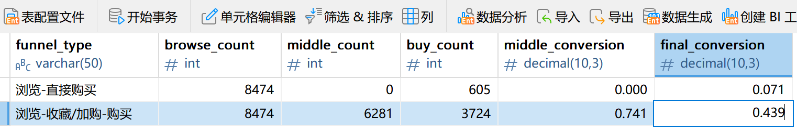

### 5、用户购买地区分析

```sql
CREATE TABLE df_customer_geohash_distribution (
    user_geohash VARCHAR(25),
    NUM int(9)
);

INSERT INTO df_customer_geohash_distribution
SELECT
    user_geohash,
    count(user_id) NUM
FROM
    customer_beauty_data
WHERE
    behavior_type = 4
GROUP BY
    user_geohash;
```
结果储存在一个表格里，稍后进行可视化分析。
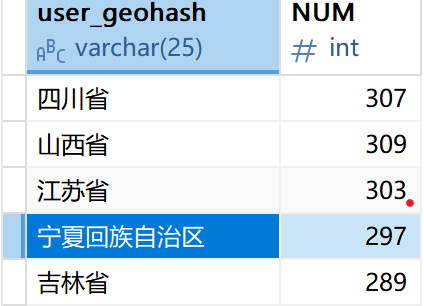

（由于Power BI禁用了着色地图功能，后面借助Python生成。）


## 四、商品分析

### 1、热门商品及品类

我们来看一下商品和品类的情况：

以下是TOP10商品归类：
```sql
-- 创建热门商品表（按购买量排序，取前10）
CREATE TABLE df_popular_item (
    item_id int(10),
    item_hot int(20)
);

INSERT INTO df_popular_item
SELECT
    item_id,
    count(item_id) item_hot
FROM
    customer_beauty_data
WHERE
    behavior_type = 4
GROUP BY
    item_id
ORDER BY
    item_hot desc,
    item_id
LIMIT 10;
```
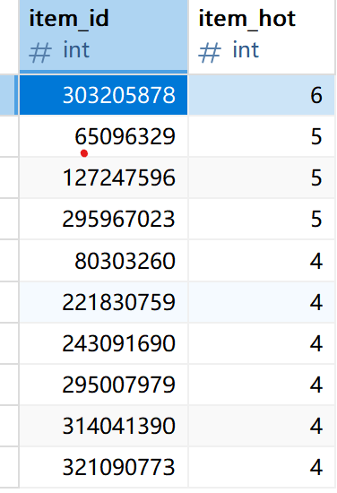

接下来是TOP10品类：
```sql
-- 创建热门品类表（按购买量排序，取前10）
CREATE TABLE df_popular_category (item_category int(10),category_hot int(20));

INSERT INTO df_popular_category
SELECT
    item_category,
    count(item_category) category_hot
FROM
    customer_beauty_data
WHERE
    behavior_type = 4
GROUP BY
    item_category
ORDER BY
    category_hot desc
LIMIT 10;

-- 这里选取的是top10的商品和种类
```
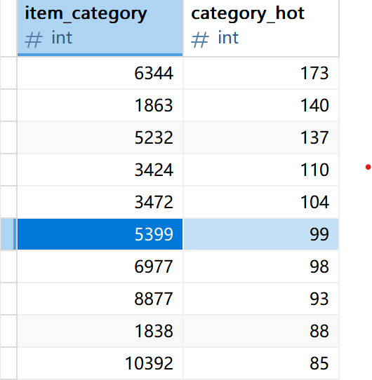


### 2、商品（品类）和用户行为的关系

我统计了每种商品或品类被浏览、收藏、加购和购买的次数，看看哪种商品需求大。
```sql
REATE TABLE df_category_count (
    item_category int(10),
    pv int(10),
    fav int(10),
    cart int(10),
    buy int(10));

INSERT INTO df_category_count
SELECT
    item_category,
    COUNT(IF(behavior_type=1,1,NULL)) pv,
    COUNT(IF(behavior_type=2,1,NULL)) fav,
    COUNT(IF(behavior_type=3,1,NULL)) cart,
    COUNT(IF(behavior_type=4,1,NULL)) buy
FROM
    customer_beauty_data 
GROUP BY
    item_category;
```    
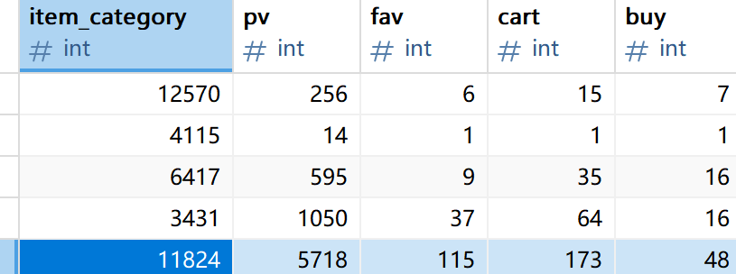


## 五、数据可视化及原因分析

### 1、流量分析
#### （1）日流量分析
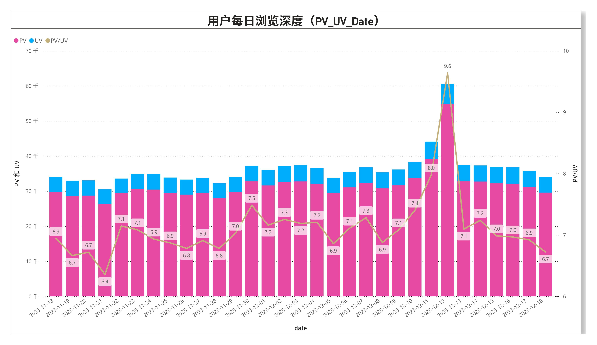
- **图表现象描述**：图表呈现了用户每日浏览量（PV）、独立访客数（UV）和浏览深度（PV/UV）的变化趋势。流量在周内呈现周期性波动，周末PV、UV略高于工作日，符合用户闲暇时间多、购物意愿强的行为逻辑；浏览深度均值稳定，说明用户单次访问会浏览多个商品，平台有一定粘性。2023-12-12各项指标均达峰值，是双十二大促活动刺激的结果，该现象在电商行业大促期间普遍合理。
- **原因分析**：用户日流量受时间和营销活动影响显著，大促可有效拉动流量和用户浏览深度，日常流量具有周末优势。
- **建议**：周末推出“周末特惠专场”，结合新品和套装优惠；大促提前预热，通过预售、分层满减延长用户浏览路径，提升流量转化。

#### （2）小时级流量分析
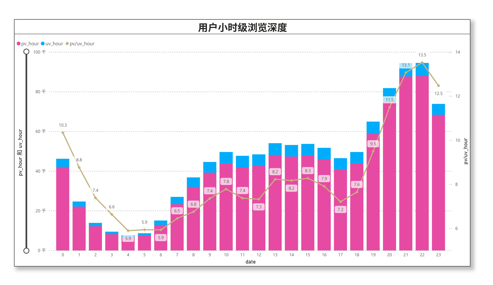
- **图表现象描述**：图表展示了用户小时级的PV、UV和浏览深度变化。每日存在两个流量高峰，10:00-12:00（午间休息）和19-22:00（晚间闲暇），其中22时浏览深度最高。凌晨0-6时各项指标处于低谷，符合用户睡眠作息，该时段分布在全行业电商中具有普遍性。
- **原因分析**：用户小时级行为受作息影响明显，晚间是流量和转化的黄金时段，午间有小高峰，凌晨几乎无有效流量。
- **建议**：晚间19-22时集中开展直播、限时秒杀等活动；午间推出“职场美妆急救”主题优惠；凌晨时段缩减营销投入，优先进行系统维护。


### 2、购买分析

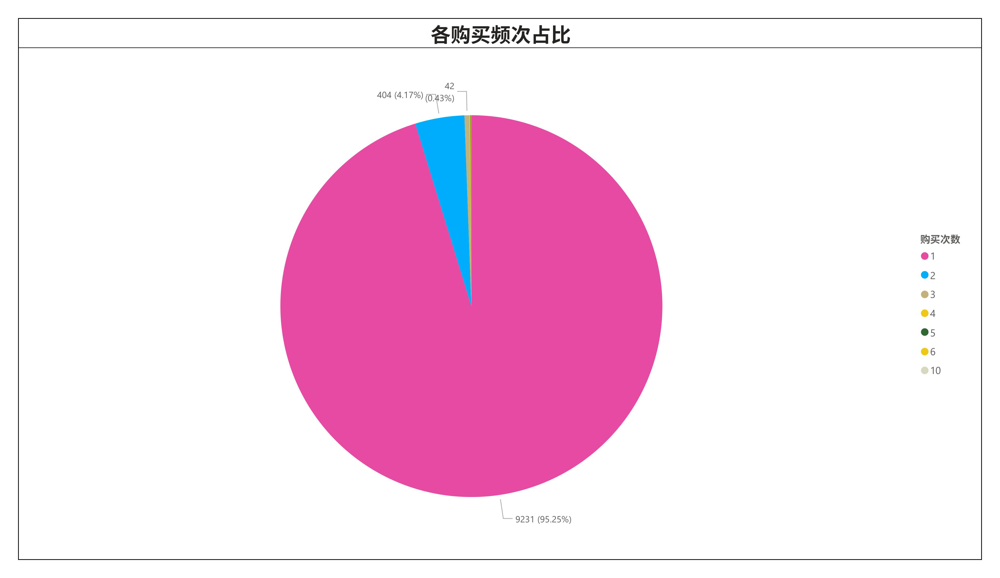
- **图表现象描述**：图表显示95.25%的用户购买频次为1次，仅4.17%的用户购买2次，3次及以上购买的用户占比极低。这是因为美妆产品使用周期较长（如护肤品1-3个月），且用户首次尝试后若未形成强偏好，复购意愿低，同时数据周期仅一个月，用户复购时间窗口不足，该分布在美妆行业短期数据中合理。
- **原因分析**：用户购买频次呈极端长尾分布，多数用户处于首次尝试阶段；复购率44%，待提升。
- **可落地建议**：可对首次购买用户推送“首单好评返现+7日复购券”；对购买2次及以上用户建立“复购会员群”，提供专属权益；基于产品使用周期，在用户使用末期推送“回购提醒+折扣”。


### 3、购买用户地域情况
（由于Power BI今年禁用了着色地图功能，下面借助Python生成。）

```python
import pandas as pd
from pyecharts import options as opts
from pyecharts.charts import Map

file_path = r"D:\MyAnalyzedProjects\美妆产品可视化分析\database\df_customer_geohash_distribution.xlsx"
df = pd.read_excel(file_path, sheet_name='df_customer_geohash_distributio')

# 检查数据
print("数据前5行：")
print(df.head())
print("\n地理哈希样例：")
print(df['user_geohash'].head())

# 提取省份和数值
provinces = df['user_geohash'].tolist()
values = df['NUM'].tolist()

# 创建数据对
data_pairs = list(zip(provinces, values))

print(f"准备绘制 {len(data_pairs)} 个地区的数据")

# 创建地图
map_chart = (
    Map()
    .add("用户数量", data_pairs, "china")
    .set_global_opts(
        title_opts=opts.TitleOpts(title="美妆用户地域分布地图"),
        visualmap_opts=opts.VisualMapOpts(
            max_=max(values) if values else 340,
            min_=min(values) if values else 100
        ),
    )
)

output_path = r"D:\MyAnalyzedProjects\美妆产品可视化分析\province_value_map.html"
map_chart.render(output_path)
print(f"地图已生成，保存路径：{output_path}")
```

以下是生成的美妆产品购买用户地域分布的HTML交互地图，可直观查看各省份购买用户分布：

<iframe 
  src="./province_value_map.html"
  width="100%"
  height="700"
  frameborder="0"
  scrolling="auto"
>
  您的浏览器不支持iframe标签，请直接打开文件夹中的「province_value_map.html」文件查看地域分布地图。
</iframe>

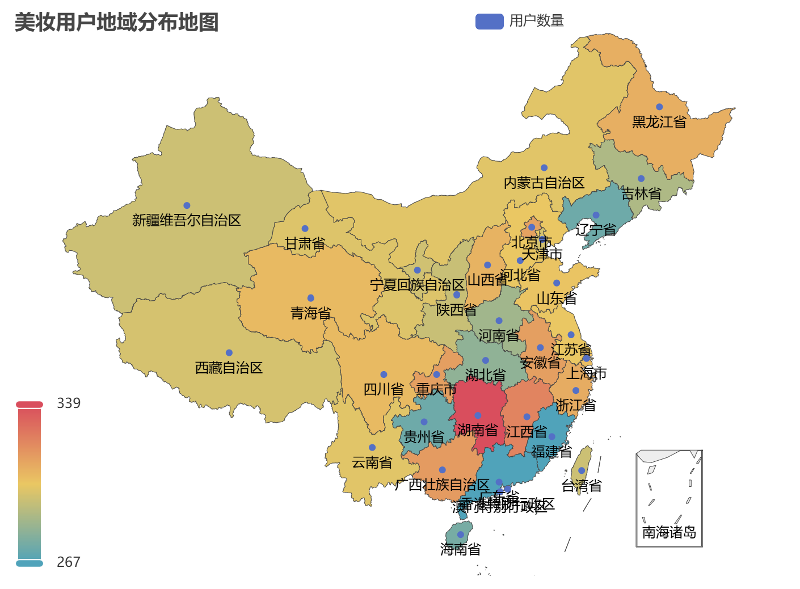

- **图表描述**：图表呈现购买用户在各省份的分布，其中最小值为267，最大值339，所以总体来说各省份差距较小。其中中东部省份（如湖南、浙江、江苏）占比高，西北部省份占比低。但注意到一个“异常”：作为日化品生产大省的广东、福建却是购买洼地。
- **原因分析**：整体趋势上，购买分布与地区消费水平、美妆消费意识和电商渗透率直接相关，经济发达地区用户消费能力强、电商渗透率较高，美妆需求旺盛，而西部市场虽然会对防晒、保湿等特殊功效的产品有更高的需求，但由于电商渗透率低，物流费用较高等问题，在整体上略逊东部市场。至于广东、福建的“异常”现象，可能是因为两省是产品源头市场，对电商渠道的依赖弱，而更青睐线下购买。注意到“香港、澳门特别行政区”的购买数分别是316、339，来到了高值，其中澳门还是最高值，也可以验证这一猜想。
- **可落地建议**：可以针对不同省份精细化运营策略，例如在核心省份增加仓储点，提升配送时效；针对中西部省份，与物流公司合作推出“区域包邮+专属满减券”，逐步渗透市场；对不同季节、不同地域而产生的需求差异化市场增加相应品类的推流，例如西北部市场的保湿防晒，东南省份的控油等。


### 4、用户行为分析
#### （1）每日用户行为统计
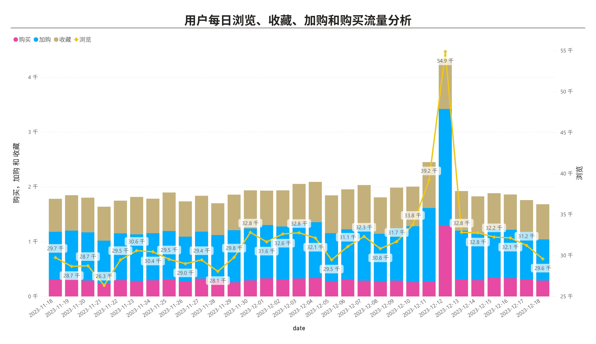
- **图表现象描述与解释**：图表中浏览、收藏、加购、购买的日度趋势高度一致，说明用户行为具有强连贯性，多数用户会经历“浏览→加购/收藏→购买”的决策流程。2023-12-12全链路流量爆发，是大促活动刺激的结果，该行为链路的一致性在电商用户中普遍合理。
- **原因分析**：用户行为链路具有强连贯性，大促对全链路行为拉动效果显著，日常行为节奏稳定。
- **可落地建议**：大促期间提前开展“收藏加购锁优惠”活动；日常对浏览量高但加购低的日期，可以退出浏览满一定数量弹窗送券。

#### （2）小时级用户行为统计
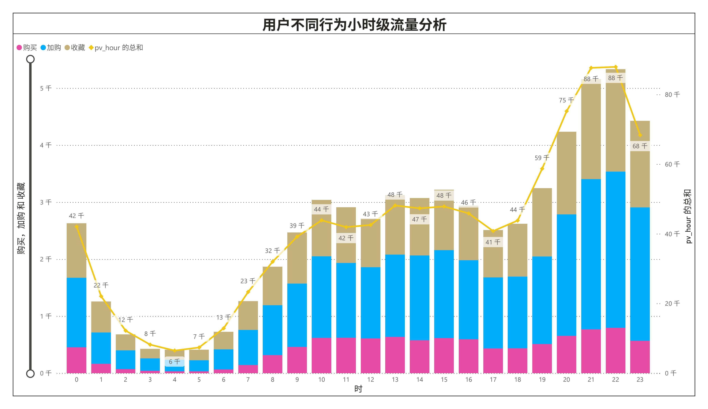
- **图表现象描述与解释**：图表显示小时级的浏览、加购、收藏、购买趋势呈“双峰”，19-22时是全链路高峰，13-14时存在小高峰，4-6时处于低谷。这与用户日间工作、晚间闲暇的作息完全契合，是电商用户小时级行为的典型特征。
- **可落地建议**：用户小时级行为受作息影响显著，晚间是行为链路的黄金时段，小高峰可针对性运营。比如晚间高峰时段开展“直播专场+限时免邮”；凌晨0时推送“夜猫子专属秒杀”；优化午间10-12时的“职场美妆”推荐内容。


### 5、用户粘性与转化分析
#### （1）次日和五日粘性率
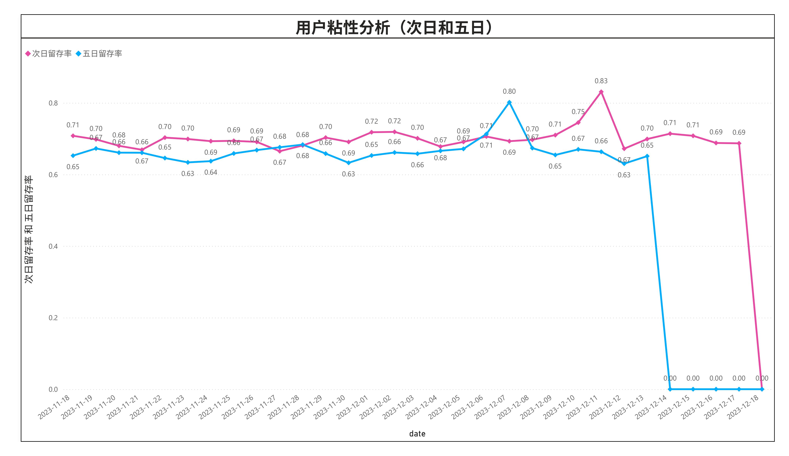
- **图表现象描述**：图表中次日留存率整体在0.65-0.71区间，五日留存率多数在0.63-0.70区间，且五日留存低于次日留存，大促节点（如2023-12-12）留存率显著冲高。这是因为大促活动提升了用户参与度，但日常留存策略效果稳定但缺乏爆发性。该留存趋势在电商行业短期数据中合理，因用户复购需要时间窗口。
- **原因分析**：这是因为大促活动提升了用户参与度，但日常留存策略效果稳定但缺乏爆发性。该留存趋势在电商行业短期数据中是合理，因用户复购需要时间窗口。用户次日留存稳定，五日留存存在流失，大促可短期提升留存，日常需强化中期留存策略。
- **可落地建议**：对次日留存用户推送“新人专属礼包”；对五日流失用户发送“收藏商品降价提醒”；大促期间推出“大促会员后续购折扣”，延长用户留存周期。

#### （2）链路转化漏斗分析
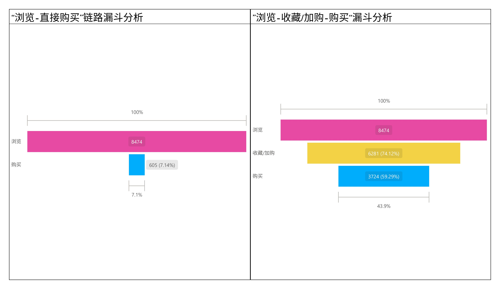
- **图表现象描述**：图表显示“浏览-直接购买”转化率仅7.14%，“浏览-收藏/加购-购买”转化率达43.9%。
- **原因分析**：这是因为美妆产品功效感知难、品牌选择多，用户需要通过收藏/加购整理意向、对比决策，该转化差异在美妆品类中具有典型性。收藏/加购是美妆用户决策的关键环节，间接链路转化效率远高于直接链路。
- **可落地建议**：可从两方面优化：一方面提升浏览到加购收藏转化，优化商品首屏展示突出核心卖点和细节，根据高加购用户特征调整广告定向，推出加购收藏送福利活动；另一方面提升加购收藏到购买转化，给这类用户发限时库存或涨价提醒、专属比价提醒、专属优惠券，展示热销评价和售后保障，简化下单流程支持多样支付。同时长期做好用户分层，对不同阶段用户推送对应内容和优惠。

后续通过A/B测试验证策略效果，追踪转化率变化。


### 6、热门商品及品类统计

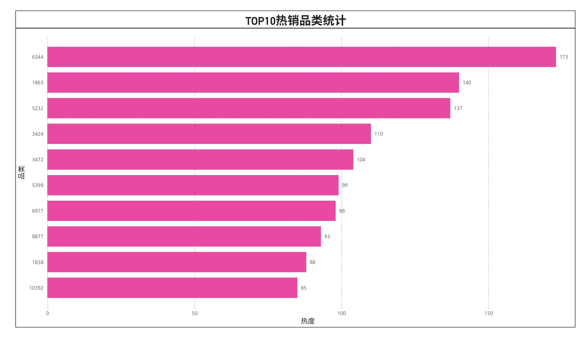
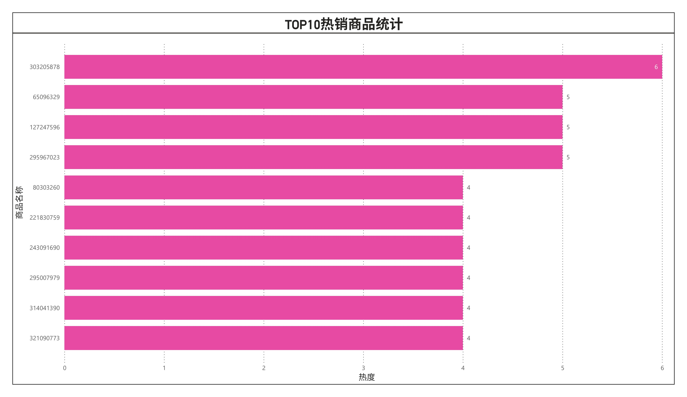

- **可落地建议**：热销的没啥好说的，主要是保证库存防止断货就行。另外就是开发同系列延伸品、互补品（例如彩妆和卸妆油）；利用热销商品口碑，在详情页关联推荐新品等等。


### 7、用户行为和商品（品类）的关系
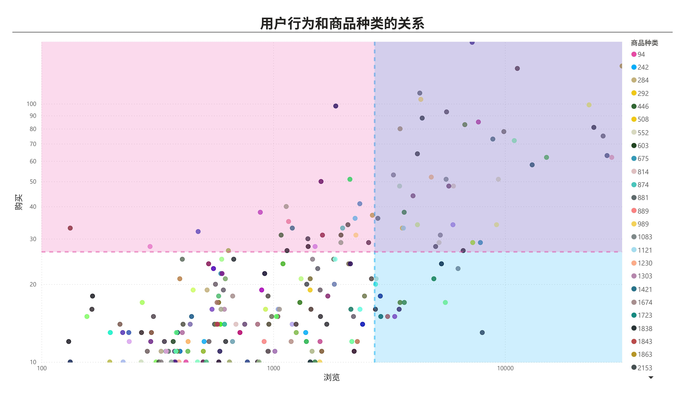
- **图表现象描述**：图表中商品分为高转化（浏览高+购买高）、高潜力（浏览低+购买高）、低转化（浏览高+购买低）、低效（浏览低+购买低）四类。不同品类因功效、价格、认知度差异，天然存在“高浏览低购买”（如小众工具）或“低浏览高购买”（如刚需护肤）的特征，该分布在多品类电商中具有共性。
- **原因分析**：商品品类转化表现分层明显，不同品类受用户偏好和认知影响，转化特征差异显著。
- **可落地建议**：高转化品类增加展示位与库存；高潜力品类通过“种草+卖点优化”提升曝光；低转化品类优化详情页或与热销品捆绑；低效品类评估淘汰，资源向高价值品类倾斜。